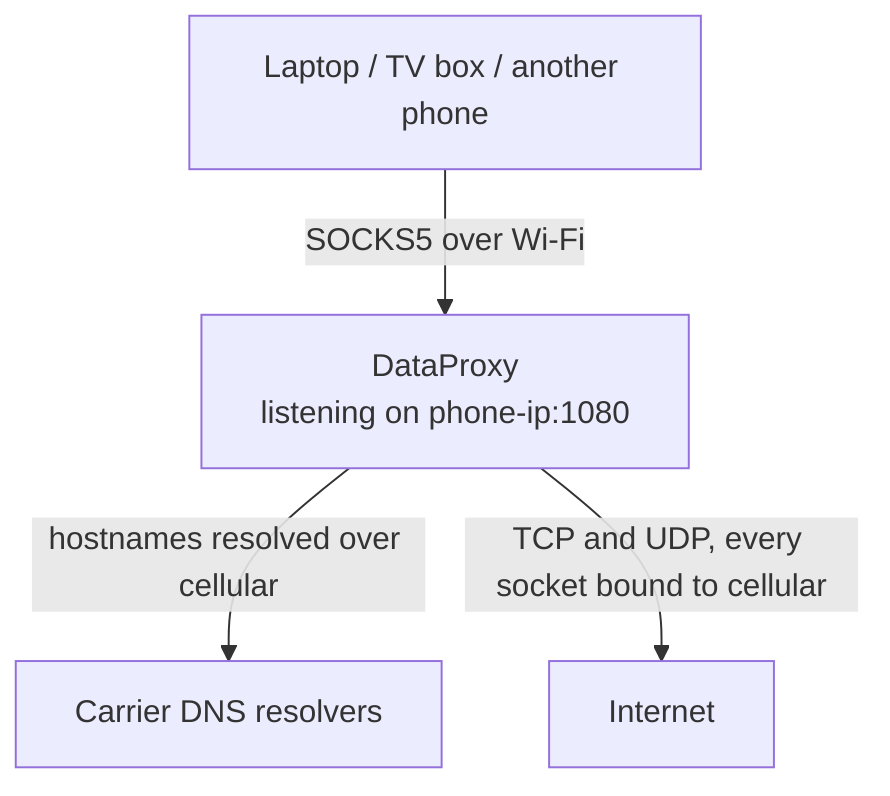

<div align="center">


# DataProxy

SOCKS5 proxy for Android that pins outbound traffic to the cellular network.

[](https://github.com/Sir-MmD/dataproxy/releases/latest)
[](LICENSE)
[](https://developer.android.com)
[](https://kotlinlang.org)

</div>

## What it does

DataProxy runs a SOCKS5 server on your phone. Clients on the same Wi-Fi point at
`phone-ip:1080`, and every socket the proxy opens is bound to the cellular
network, regardless of which network Android treats as the default.



The listener stays on the Wi-Fi interface so clients can reach it, while TCP,
UDP and DNS all leave over cellular. There is no VPN service, no root, no
iptables rules and no tethering. Only the sockets DataProxy opens are affected;
the rest of the phone keeps using Wi-Fi normally.

<div align="center">
  
</div>

## Install

Current release: **v1.3**

Grab `DataProxy-v1.3.apk` from
[Releases](https://github.com/Sir-MmD/dataproxy/releases/latest).
Requires Android 8.0 or newer.

## Usage

1. Open the app and grant the permissions it asks for.
2. Pick a listen address and port under **Listen** (default `0.0.0.0:1080`).
3. Optionally set a username and password under **Auth**.
4. Tap the power button.

Then point your client at the phone's IP on that port.

### Renew web server (rotate the carrier IP)

The **Renew** screen (opened from the Home card) has the renew server
toggle. It shares the SOCKS bind address on its own port (default `8080`)
and serves one route:

```
GET /renew -> airplane mode ON, radio confirmed off, airplane OFF,
mobile data back, answer 200
```

There is no fixed sleep: the app watches the modem via `TelephonyCallback`
and drops airplane mode the moment the radio reports off (up to 25 s,
including one re-kick), then waits for mobile data to reconnect (30 s
timeout) before answering.

A script on the LAN rotates the egress IP with one curl:

```bash
curl http://<phone-ip>:8080/renew
```

### Shizuku (required for the renew)

A plain app cannot toggle airplane mode: on modern Android a raw
`Settings.Global` write changes the flag but never touches the radio
(verified on a Samsung A55: setting reads 1, modem stays `IN_SERVICE`).
The renew therefore drives the toggle through Shizuku, which runs
`cmd connectivity airplane-mode` with shell privilege, the same path the
quick-settings tile uses.

Set it up once:

1. Install [Shizuku](https://github.com/RikkaApps/Shizuku) on the phone.
2. Start it via wireless debugging (Developer options, no PC needed).
3. Open the **Renew** screen in DataProxy and tap **Authorize via Shizuku**.

The Renew screen shows the live Shizuku status; `/renew` answers 500 until
it is authorized.

Use remote DNS so hostnames resolve over cellular rather than on the client:

| Client | Setting |
|---|---|
| curl | `--socks5-hostname`, or a `socks5h://` URL |
| Firefox | enable "Proxy DNS when using SOCKS v5" |
| Chrome | uses remote DNS with SOCKS5 already |

## Staying alive in the background

Android, and Samsung, Xiaomi, Huawei and OnePlus in particular, will kill a
background proxy to save battery. The **Anti-Kill** screen shows which of the
relevant settings are still missing and links straight to them: battery
optimisation, auto-launch, background activity and the Recents lock. It can also
restart the proxy automatically after a reboot.

## Protocol support

- `CONNECT` (TCP) and `UDP ASSOCIATE`, per RFC 1928
- Username/password authentication per RFC 1929, toggleable without restarting
- IPv4, IPv6 and domain address types
- Hostnames resolved through the cellular link's own DNS servers
- `BIND` is not implemented and returns `REP_COMMAND_NOT_SUPPORTED`

## Limitations

**IPv6 depends on your carrier.** If the APN is IPv4 only, the cellular link has
no IPv6 route, so IPv6-only destinations are unreachable. The proxy reports them
as network-unreachable, and clients will usually then resolve those names
themselves over whatever network they can reach.

**A SOCKS5 proxy cannot guarantee DNS privacy.** It only ever sees the names a
client chooses to send it. If a client resolves a hostname locally and connects
by IP, that lookup never reaches the phone. Enable remote DNS on the client.

## Permissions

| Permission | Why |
|---|---|
| `INTERNET` | Outbound sockets |
| `ACCESS_NETWORK_STATE` | Request and hold the cellular network handle |
| `FOREGROUND_SERVICE`, `FOREGROUND_SERVICE_SPECIAL_USE` | Keep running with the screen off |
| `POST_NOTIFICATIONS` | Status notification (Android 13+) |
| `READ_BASIC_PHONE_STATE` | Operator name and radio type in the header |
| `RECEIVE_BOOT_COMPLETED` | Optional auto-start after reboot |
| `WAKE_LOCK` | Hold the CPU awake while proxying |
| `REQUEST_IGNORE_BATTERY_OPTIMIZATIONS` | Prompt to exempt the app from Doze |

The renew also declares Shizuku's `API_V23` permission; it is granted at
install and only matters once you authorize the app inside Shizuku.

Nothing is collected or sent anywhere. Traffic counters and the device list are
in-memory only and reset when the proxy stops.

## Building

```bash
./gradlew :app:assembleRelease
```

Needs JDK 17 and Android SDK 36. Signing is optional: without a keystore at
`app/keystore/dataproxy-release.jks` the build produces an unsigned APK.

## Nightly builds

`.github/workflows/release.yml` builds a signed APK on every push to `main`
and publishes it to a single rolling release named **Nightly**
(`/releases/tag/nightly`). The release is replaced in place, never
duplicated, and it is a normal release, not a pre-release.

The workflow needs the signing key as repository secrets. From a machine
that has the keystore:

```bash
base64 -w0 dataproxy-release.jks | gh secret set KEYSTORE_BASE64
gh secret set KEYSTORE_PASSWORD --body dataproxy
gh secret set KEY_ALIAS --body dataproxy
gh secret set KEY_PASSWORD --body dataproxy
```

`KEYSTORE_PASSWORD`, `KEY_ALIAS` and `KEY_PASSWORD` are optional when they
match the defaults baked into `app/build.gradle.kts` (`dataproxy`); without
`KEYSTORE_BASE64` the workflow fails on purpose rather than publishing an
unsigned, uninstallable APK.

## License

MIT. See [LICENSE](LICENSE).
